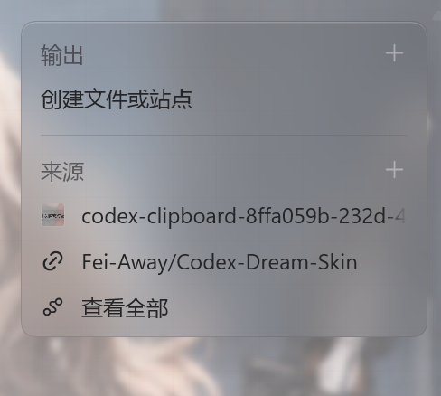
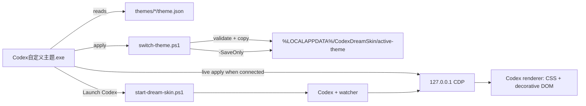

# One sentence to tell an AI to install this project

> Install [bilbillm/Codex-Dream-Skin-Switcher](https://github.com/bilbillm/Codex-Dream-Skin-Switcher) for me: download the Windows x64 ZIP from the [latest Release](https://github.com/bilbillm/Codex-Dream-Skin-Switcher/releases/latest), verify it against `SHA256SUMS.txt`, extract it to a permanent writable directory, run the root-level `安装快捷方式.ps1`, launch “Codex 自定义主题” from the desktop or Start Menu, and verify that the hot-switch service, active theme, and Codex renderer injection are healthy.

English | [简体中文](README.md)

# Codex Dream Skin Switcher

A Windows GUI for previewing, importing, hot-switching, and launching custom Codex Dream Skin themes. Version `v0.2.0` unifies theme selection, application, and Codex launch in one inspectable desktop console.

[](https://github.com/bilbillm/Codex-Dream-Skin-Switcher/releases/latest)
[](LICENSE)


> [!IMPORTANT]
> This is not an official Codex theme and cannot appear in the official theme settings. It injects CSS and a small amount of decorative DOM through a Chromium DevTools Protocol endpoint bound to the local loopback interface. It does not modify `WindowsApps`, `app.asar`, the official package signature, accounts, conversations, projects, or API configuration.

## Console overview

The `v0.2.0` unified console keeps theme preview, theme cards, Apply, and Launch Codex in one window, with optional post-launch tray minimization.

### Frosted pinned-summary card



## Why this project exists

The original Dream Skin runtime is well suited to scripted installation and tray operations, but daily multi-theme use still has friction:

- Light and dark themes are difficult to identify without opening JSON files.
- Home and task backgrounds cannot be compared before applying a theme.
- A misplaced theme folder or invalid image path often fails late in the injection flow.
- A normal Codex process, a CDP-enabled Codex process, and the watcher state are easy to confuse.
- Script, desktop, and Start Menu entry points provide inconsistent feedback.

This project adds a GUI layer without weakening Dream Skin's process and path checks:

- Scans `themes/<theme>/theme.json` automatically.
- Previews home and task images.
- Labels light, dark, and automatic appearance.
- Hot-applies a theme without restarting Codex.
- Imports valid theme folders while blocking traversal and reparse points.
- Starts or activates Codex with the current theme.
- Creates desktop and Start Menu shortcuts.

## Features

| Feature | Behavior |
|---|---|
| Theme catalog | Scans the adjacent `themes` directory; each child directory is one theme |
| Image preview | Switches between home and task images without locking their source files |
| Apply theme | Hot-switches a connected session or safely saves the selection for the next launch |
| Launch Codex | Saves the selected theme first, then activates a healthy session or starts Codex, CDP, and the watcher |
| Theme import | Copies a valid folder and rejects absolute image paths, traversal, reparse points, and dangerous names |
| Runtime status | Reports watcher connection, selected theme, progress, and errors |
| Shortcuts | Installs one argument-free desktop and Start Menu console entry |
| Recovery | Leaves the official package untouched; ending the debug session or running restore returns the official appearance |

## Bundled themes

### Angelina Gravity Field

- Appearance: light
- Home image: 2048×1152 PNG
- Task image: 1280×720 JPEG
- Visual language: pearl-white technical materials, charcoal information layers, messenger red, and restrained cyan gravity feedback
- Best for: bright environments and longer reading sessions

### Angelina Midnight Gravity

- Appearance: dark
- Home image: 2048×1152 PNG
- Task image: 1280×720 JPEG
- Visual language: moonlit operations terrace, sparse city lighting, cyan gravity traces, and dark glass surfaces
- Best for: low-light environments and dark workflows

Both themes include continuous wallpaper, frosted-glass side/right/bottom panels, frosted chat bubbles and in-app secondary menus, a frosted top-right pinned-summary card, a composer-matched white-text multi-question response card, native terminal protection, and no styling of Electron's native `File/Edit/View/Help` menus.

## Requirements

### Using a Release

- Windows 10 or Windows 11 x64.
- The official Microsoft Store Codex/ChatGPT desktop app, internally registered as `OpenAI.Codex`.
- Node.js 22 or newer; `24.7.0` is the validated version.
- Windows PowerShell 5.1, included with Windows.
- The release GUI is self-contained and does not require a separately installed .NET Desktop Runtime.
- The `v0.2.0` self-contained package pins Windows Desktop Runtime `10.0.10`.

### Building from source

- .NET SDK 10.0.
- Node.js 22+.
- Git.
- PowerShell 7 may be used for development commands, but the GUI deliberately launches Dream Skin startup scripts through Windows PowerShell 5.1. PowerShell 7 automatically converts ISO JSON timestamps into `DateTime`, whose localized string form breaks the runtime's strict process-start identity comparison.

> [!NOTE]
> Version `v0.2.0` was verified against `OpenAI.Codex_26.715.7063.0_x64__2p2nqsd0c76g0`. The runtime discovers the registered official Store package dynamically; this exact version is not hard-coded as a launch target.

## Installation

### Method 1: ask an AI agent

Give the sentence at the top of this README to an AI coding agent that can access local files, PowerShell, and GitHub. A correct installation should:

1. Download the ZIP and `SHA256SUMS.txt` from `releases/latest`.
2. Compute the ZIP's SHA-256 and compare it with the manifest.
3. Extract into a permanent directory such as `D:\codex自定义主题` or `%LOCALAPPDATA%\CodexDreamSkinSwitcher`.
4. Run:

   ```powershell
   powershell.exe -NoProfile -ExecutionPolicy Bypass -File .\安装快捷方式.ps1
   ```

5. Launch “Codex 自定义主题”.
6. Verify that the watcher in `%LOCALAPPDATA%\CodexDreamSkin\state.json` is alive and the active page contains the `codex-dream-skin` class.

### Method 2: manual installation

1. Open the [latest Release](https://github.com/bilbillm/Codex-Dream-Skin-Switcher/releases/latest).
2. Download the ZIP and `SHA256SUMS.txt`.
3. Verify the archive:

   ```powershell
   Get-FileHash -Algorithm SHA256 .\Codex-Dream-Skin-Switcher-v0.2.0-win-x64.zip
   Get-Content .\SHA256SUMS.txt
   ```

4. Extract it into a directory you will keep. Do not move only the EXE: it needs the adjacent `engine`, `themes`, and `switch-theme.ps1` files.
5. Run the shortcut installer:

   ```powershell
   powershell.exe -NoProfile -ExecutionPolicy Bypass -File .\安装快捷方式.ps1
   ```

6. Open “Codex 自定义主题” from the desktop or Start Menu.

### What the installer creates

| Location | Name | Arguments | Purpose |
|---|---|---|---|
| Desktop | `Codex 自定义主题` | none | Open the unified console |
| Start Menu | `Codex 自定义主题` | none | Same console entry |

The installer does not move files, request administrator privileges, modify WindowsApps, touch credentials, or pin to the taskbar. It removes this project's legacy `Codex 主题切换器` Start Menu entry.

Optional switches:

```powershell
.\安装快捷方式.ps1 -SkipDesktop
.\安装快捷方式.ps1 -SkipStartMenu
```

## Daily use

### Select, apply, and launch

1. Open “Codex 自定义主题”, choose a theme card, and compare Home and Task previews.
2. Click Apply: connected Codex sessions hot-switch immediately; disconnected sessions save the choice for the next launch.
3. Click Launch Codex: the console safely saves the selected theme, then verifies a healthy session or starts Codex, CDP, and the watcher.
4. After success, the console minimizes to the system tray by default. Double-click the tray icon to restore it, or change the behavior in Settings.

When an ordinary Codex session needs CDP for the first time, the runtime asks before restarting to protect unsent input. A healthy-session activation takes about 1.2 seconds; rebuilding a stopped watcher takes about 18 seconds.

### Importing a theme

Choose a directory whose top level directly contains `theme.json`. The importer validates required fields and images, requires relative paths, blocks traversal and reparse points, sanitizes dangerous Windows names, and prompts before updating an existing ID.

## Theme format

Minimal theme:

```json
{
  "schemaVersion": 1,
  "id": "my-theme",
  "name": "My Theme",
  "image": "background.png",
  "appearance": "dark"
}
```

Full example:

```json
{
  "schemaVersion": 1,
  "id": "my-theme",
  "name": "My Theme",
  "skinRevision": "3.1.4-angelina",
  "visualRevision": 1,
  "variant": "angelina",
  "brandSubtitle": "CUSTOM / THEME",
  "tagline": "A short line shown on the home route.",
  "projectPrefix": "PROJECT / ",
  "projectLabel": "SELECT PROJECT",
  "statusText": "SYSTEM · READY",
  "quote": "Optional quote.",
  "image": "background.png",
  "taskImage": "task-background.jpg",
  "appearance": "dark",
  "art": {
    "focusX": 0.72,
    "focusY": 0.42,
    "safeArea": "left",
    "taskMode": "ambient"
  },
  "palette": {
    "accent": "#c85b55"
  }
}
```

See [`docs/THEME-FORMAT.md`](docs/THEME-FORMAT.md). Keep IDs stable, use relative image paths, use `light`/`dark`/`auto`, do not place scripts or remote URLs in image fields, and prefer lower-detail 16:9 task backgrounds.

## Architecture



| Module | Responsibility |
|---|---|
| `src/CodexThemeSwitcher` | Unified console, catalog, preview, import, launch, tray, and process calls |
| `switch-theme.ps1` | Theme path boundary, validation, offline active-theme write, and one-shot hot apply |
| `engine/scripts/common-windows.ps1` | Official Store package discovery, process identity, ports, and atomic files |
| `engine/scripts/theme-windows.ps1` | Theme store, switching, pause state, and operation UI |
| `engine/scripts/injector.mjs` | CDP sessions, target discovery, injection, watch, and verification |
| `engine/assets/renderer-inject.js` | Renderer-side CSS/DOM installation, observation, and cleanup |
| `engine/assets/dream-skin.css` | Theme visuals, frosted surfaces, and layout overrides |

See [`docs/ARCHITECTURE.md`](docs/ARCHITECTURE.md).

## Runtime locations

| Content | Location |
|---|---|
| Program and bundled themes | The extracted Release directory |
| Active theme | `%LOCALAPPDATA%\CodexDreamSkin\active-theme` |
| Saved themes | `%LOCALAPPDATA%\CodexDreamSkin\themes` |
| Imported images | `%LOCALAPPDATA%\CodexDreamSkin\images` |
| Watcher state | `%LOCALAPPDATA%\CodexDreamSkin\state.json` |
| Logs | `%LOCALAPPDATA%\CodexDreamSkin\injector*.log` |
| Verification | `%LOCALAPPDATA%\CodexDreamSkin\verify.log` |

## Security and privacy

The project does not read or upload API keys, Codex login tokens, conversation content, project files, browser cookies, or unrelated application data.

The runtime binds CDP to `127.0.0.1`, validates port range and the registered Store package, records Browser ID/package/Node/PID/start time, and revalidates process identity before stopping a watcher. Other processes running as the same Windows user may still access a loopback debugging port, so avoid untrusted local software while Dream Skin is active.

Imported themes are treated as data. The GUI reads JSON and images but does not execute scripts from theme folders. See [`SECURITY.md`](SECURITY.md).

## Updating

1. Exit the console (choose “退出控制台” from its tray menu when minimized).
2. Download and verify the new Release.
3. Extract into a new directory or replace static files.
4. Run `安装快捷方式.ps1` again.
5. Open the console, select a theme, and verify watcher status.

Replacing program files does not automatically delete active or saved themes under `%LOCALAPPDATA%\CodexDreamSkin`.

## Uninstall and restore

Remove this project's shortcuts only:

```powershell
powershell.exe -NoProfile -ExecutionPolicy Bypass -File .\卸载快捷方式.ps1
```

Restore official Codex appearance:

```powershell
powershell.exe -NoProfile -ExecutionPolicy Bypass `
  -File .\engine\scripts\restore-dream-skin.ps1 `
  -RestoreBaseTheme -PromptRestart
```

Review the restore script before adding `-Uninstall`. Recovery does not delete conversations, projects, or non-appearance settings.

## Troubleshooting

| Symptom | Likely cause | Action |
|---|---|---|
| Waiting to launch Codex | Codex is not connected through Dream Skin, or watcher exited | Select a theme and click Launch Codex in the console |
| Apply does not update immediately | CDP unavailable or Browser ID changed | The theme is saved for next launch; click Launch Codex to reconnect |
| Console remains busy | Store update, slow startup, or verification timeout | Allow up to 45 seconds; inspect `injector-error.log` and `verify.log` |
| First launch asks to restart | Existing Codex lacks CDP | Save unsent text, then approve; cancel is non-destructive |
| Theme absent | Missing/invalid JSON or image | Validate against the format and use relative paths |
| Preview fails | Unsupported WinForms image encoding | Convert to standard RGB PNG/JPEG |
| Styling breaks after update | Codex DOM/classes changed | Record the Codex version and screenshot; do not patch WindowsApps |
| Port 9335 occupied | Another process listens there | Close the unknown listener; never trust an unverified endpoint |

See [`docs/TROUBLESHOOTING.md`](docs/TROUBLESHOOTING.md). Never include credentials, conversations, or full home-directory inventories in issues.

## Development and release

```powershell
git clone git@github.com:bilbillm/Codex-Dream-Skin-Switcher.git
cd Codex-Dream-Skin-Switcher
dotnet build .\src\CodexThemeSwitcher\CodexThemeSwitcher.csproj -c Release

.\scripts\build-release.ps1 -Version 0.2.0
.\scripts\verify-release.ps1 -Version 0.2.0
```

The default release is self-contained. Use `-FrameworkDependent` for a smaller build that requires .NET Desktop Runtime 10.

Future publishers may pass `-RuntimeFrameworkVersion` to select a different runtime patch, provided the matching win-x64 pack is available from NuGet or the local cache.

After testing and building, a maintainer with an authenticated GitHub CLI session can publish with:

```powershell
.\scripts\publish-release.ps1 -Version 0.2.0 -ReleaseTitle 'v0.2.0 - 统一启动控制台 / Unified launch console'
```

The script pushes Git over SSH, then uses `gh` to create the public repository, set topics, and upload Release assets. It never reads or prints a plaintext token.

Test commands:

```powershell
node --test .\engine\tests\*.test.mjs
powershell.exe -NoProfile -ExecutionPolicy Bypass -File .\engine\tests\run-tests.ps1
```

The `v0.2.0` release gate includes a zero-warning .NET build, offline theme saving, GUI self-test, real light/dark hot switching, renderer markers, cold/fast launch paths, tray restore, 150% DPI console screenshots, ZIP inventory, SHA-256, and credential-pattern scanning.

## Repository layout

```text
Codex-Dream-Skin-Switcher/
├─ src/CodexThemeSwitcher/  # WinForms source and hot-switch bridge
├─ engine/                   # Dream Skin runtime and tests
├─ themes/                   # Bundled themes
├─ scripts/                  # Build, release, shortcut, verification tools
├─ docs/                     # Format, architecture, troubleshooting, screenshots
├─ README.md                 # Chinese default documentation
├─ README.en.md              # English documentation
├─ CHANGELOG.md
├─ SECURITY.md
├─ THIRD-PARTY-NOTICES.md
└─ LICENSE
```

## Known limitations

- Windows x64 only.
- No official theme registration.
- Native Electron menus are not frosted.
- Major Codex updates may require selector changes.
- CDP expands local debugging capability for same-user processes.
- Theme import does not install fonts, programs, or remote dependencies.
- Bundled character art involves third-party rights and is not intended for unreviewed commercial use.

## FAQ

### Why not modify `app.asar`?

Changing `app.asar` or WindowsApps breaks signature, update, and recovery expectations. CDP injection leaves the official package unchanged.

### Why can a theme switch without restarting?

The watcher retains a verified CDP connection. The console updates the active theme and performs a one-shot injection that replaces CSS variables, image URLs, and theme classes.

### Are launch and theme switching in the same interface?

Yes. The Release contains only `Codex自定义主题.exe`, which always opens the unified console. Selecting a theme alone does not change Codex; use Apply or Launch Codex to make it effective. The historical `--launch` argument is retained only for old-shortcut compatibility and opens the same console.

### Can it live on another drive?

Yes. Keep the whole extracted directory together. Scannable themes live under its adjacent `themes` directory.

### Does it interfere with Codex updates?

No Store files are modified. Launch through the themed entry again after an update, and upgrade this project if DOM changes break styling.

### Why Windows PowerShell 5.1?

Dream Skin compares ISO timestamp strings as part of process identity. PowerShell 7 localizes the JSON-converted `DateTime`; 5.1 preserves the original string expected by the runtime.

## Contributing

Contributions are welcome for original themes with clear redistribution rights, new Codex selector compatibility, reproducible console/hot-switch/DPI fixes, bilingual docs, and security tests. Read [`CONTRIBUTING.md`](CONTRIBUTING.md).

## Upstream and credits

- Runtime upstream: [Fei-Away/Codex-Dream-Skin](https://github.com/Fei-Away/Codex-Dream-Skin)
- Base commit: `e776fa6d5361a2bdd5c1614674397681e7b00874`
- Runtime revision: `3.1.4-angelina`
- Build details: [`engine/BUILD-INFO.md`](engine/BUILD-INFO.md)
- Asset provenance: [`engine/references/asset-provenance.md`](engine/references/asset-provenance.md)

## License and non-affiliation

Source code is available under the [MIT License](LICENSE). The bundled upstream runtime license is preserved at [`engine/LICENSE-UPSTREAM.txt`](engine/LICENSE-UPSTREAM.txt).

Theme images, third-party characters, names, trademarks, and reference works are not relicensed by the code's MIT license. Read [`THIRD-PARTY-NOTICES.md`](THIRD-PARTY-NOTICES.md). This project is not affiliated with, endorsed by, or sponsored by OpenAI, Hypergryph, Yostar, or Arknights.
