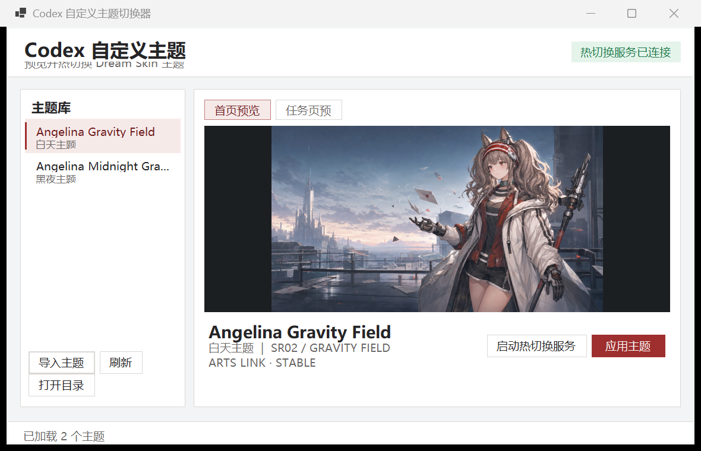
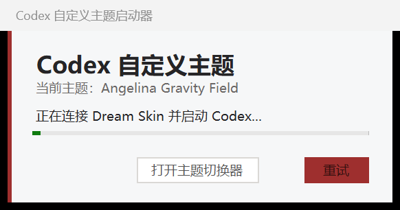
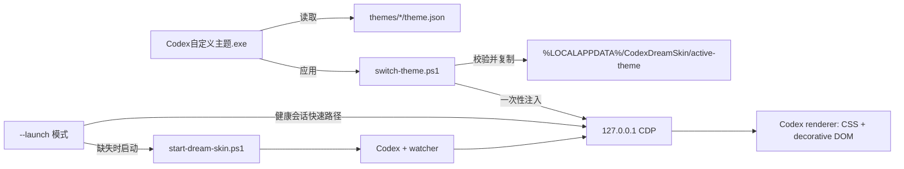

# 一句话告诉 AI 安装这个项目

> 请为我安装 [bilbillm/Codex-Dream-Skin-Switcher](https://github.com/bilbillm/Codex-Dream-Skin-Switcher)：从 [最新 Release](https://github.com/bilbillm/Codex-Dream-Skin-Switcher/releases/latest) 下载 Windows x64 ZIP，核对 `SHA256SUMS.txt`，解压到一个长期保留且可写的目录，运行根目录的 `安装快捷方式.ps1`，然后通过桌面或开始菜单里的“Codex 自定义主题”启动，并确认热切换服务、当前主题和 Codex 页面注入都正常。

[English](README.en.md) | 简体中文

# Codex Dream Skin Switcher

Windows 版 Codex 自定义主题预览、导入、热切换与一键启动工具。当前 `v0.1.1` 内置 Angelina Gravity Field 白天主题和 Angelina Midnight Gravity 黑夜主题，并把 Dream Skin 的脚本式工作流包装成一个安静、可检查的 Windows GUI。

[](https://github.com/bilbillm/Codex-Dream-Skin-Switcher/releases/latest)
[](LICENSE)


> [!IMPORTANT]
> 这不是 Codex 官方主题，也不会注册到官方“设置”主题列表。它通过仅监听本机回环地址的 Chromium DevTools Protocol（CDP）向正在运行的 Codex 渲染页面注入 CSS 和少量装饰 DOM。项目不修改 `WindowsApps`、`app.asar`、官方签名、账号、对话、项目或 API 配置。

## 界面预览

### 主题切换器



### 一键启动器



### 置顶摘要磨砂卡片


## 它解决什么问题

Dream Skin 原始运行时非常适合脚本化安装和托盘操作，但维护多个主题时仍有几个日常问题：

- 不打开 JSON 很难直观看到哪个主题是白天、哪个是黑夜。
- 切换前无法同时比较首页图和任务页图。
- 新主题目录容易放错位置，图片路径错误通常要到注入阶段才暴露。
- 普通 Codex、带 CDP 的 Codex 和 watcher 状态容易混淆。
- 从脚本、桌面快捷方式和开始菜单进入时，体验不一致。

本项目在不破坏 Dream Skin 安全边界的前提下增加一个 GUI 层：

- 自动扫描 `themes/<主题>/theme.json`。
- 显示首页和任务页图片预览。
- 明确标记白天、黑夜或自动外观。
- 一键热应用，无需为了换主题重启 Codex。
- 从任意合法主题目录导入，并防止路径穿越与链接文件。
- 一键启动或唤醒带当前主题的 Codex。
- 自动创建桌面和开始菜单快捷方式。

## 核心功能

| 功能 | 行为 |
|---|---|
| 主题目录 | 扫描程序目录下的 `themes`，每个子目录对应一个主题 |
| 图片预览 | 在 GUI 中切换首页图和任务页图，不锁定原文件 |
| 热切换 | 校验主题后写入 `%LOCALAPPDATA%\CodexDreamSkin\active-theme`，通过已验证 CDP 会话即时应用 |
| 一键启动 | 健康会话直接唤醒 Codex；会话缺失时启动 Codex、CDP 和 watcher |
| 主题导入 | 拷贝合法目录，拒绝绝对图片路径、越界路径、reparse point 和危险目录名 |
| 状态显示 | 显示 watcher 是否连接、当前主题和操作结果 |
| 快捷方式 | 可安装桌面启动入口、开始菜单启动入口和开始菜单切换器入口 |
| 可恢复性 | 不改官方安装文件；关闭调试会话或使用引擎恢复脚本即可回到官方外观 |

## 内置主题

### Angelina Gravity Field

- 类型：白天主题（`appearance: light`）
- 首页：2048×1152 PNG
- 任务页：1280×720 JPEG
- 风格：珍珠白机能材质、炭黑信息层、信使红强调色、青绿色重力术反馈
- 适合：明亮环境、长时间阅读、希望 UI 与人物主视觉保持轻盈时

### Angelina Midnight Gravity

- 类型：黑夜主题（`appearance: dark`）
- 首页：2048×1152 PNG
- 任务页：1280×720 JPEG
- 风格：月夜作战平台、低亮度城市灯光、青色重力轨迹、深色玻璃面板
- 适合：夜间使用、暗色工作流或低环境光

两个主题都包含：

- 连续壁纸与任务页低干扰背景。
- 左侧栏、右侧栏和底部栏磨砂玻璃。
- 聊天气泡、项目/任务操作、个人资料、模型和权限等应用内二级菜单磨砂玻璃。
- 右上角置顶摘要浮动卡片、分区标题、条目、焦点态和分隔线磨砂玻璃。
- “回答问题”多题选择卡与输入框使用同一套磨砂玻璃，文字、图标和选项统一为白色高对比。
- 原生终端区域的背景和交互保护。
- 不修改顶部 Electron 原生 `文件/编辑/视图/帮助` 菜单。

## 系统要求

### 使用 Release

- Windows 10 或 Windows 11 x64。
- Microsoft Store 安装的官方 Codex/ChatGPT 桌面应用，内部包名为 `OpenAI.Codex`。
- Node.js 22 或更高版本；已验证版本为 `24.7.0`。
- Windows PowerShell 5.1（Windows 自带）。
- Release 中的 GUI 是自包含程序，无需另装 .NET Desktop Runtime。
- `v0.1.1` 自包含包固定使用 .NET Windows Desktop Runtime `10.0.10`。

### 从源码构建

- .NET SDK 10.0。
- PowerShell 7 可用于开发命令，但 Dream Skin 启动脚本由 GUI 固定交给 Windows PowerShell 5.1，以避免 PowerShell 7 对 ISO 时间字段自动转成 `DateTime` 后造成严格进程身份比较误判。
- Node.js 22+。
- Git。

> [!NOTE]
> 当前验证目标为 `OpenAI.Codex_26.715.7063.0_x64__2p2nqsd0c76g0`。Codex 桌面端更新后，包版本变化是正常的；引擎会动态发现已注册的官方 Store 包，不把这个版本号硬编码为启动目标。

## 安装

### 方法一：让 AI 安装

把 README 开头的那句话直接发给一个能访问本机文件、PowerShell 和 GitHub 的 AI 编程代理。代理至少应完成以下核对：

1. 从 `releases/latest` 下载 ZIP 和 `SHA256SUMS.txt`。
2. 对 ZIP 计算 SHA-256，并与清单比较。
3. 解压到长期保留的目录，例如 `D:\codex自定义主题` 或 `%LOCALAPPDATA%\CodexDreamSkinSwitcher`。
4. 运行：

   ```powershell
   powershell.exe -NoProfile -ExecutionPolicy Bypass -File .\安装快捷方式.ps1
   ```

5. 启动“Codex 自定义主题”。
6. 确认 `%LOCALAPPDATA%\CodexDreamSkin\state.json` 中的 watcher 存活，且活动页面含 `codex-dream-skin` 类。

### 方法二：手动安装

1. 打开 [Releases](https://github.com/bilbillm/Codex-Dream-Skin-Switcher/releases/latest)。
2. 下载：
   - `Codex-Dream-Skin-Switcher-v0.1.1-win-x64.zip`
   - `SHA256SUMS.txt`
3. 在 PowerShell 中校验：

   ```powershell
   Get-FileHash -Algorithm SHA256 .\Codex-Dream-Skin-Switcher-v0.1.1-win-x64.zip
   Get-Content .\SHA256SUMS.txt
   ```

4. 把 ZIP 解压到不会随手删除的位置。程序依赖同目录的 `engine`、`themes` 和 `switch-theme.ps1`，不要只把 EXE 单独移走。
5. 右键 `安装快捷方式.ps1`，选择“使用 PowerShell 运行”；或者在终端执行：

   ```powershell
   powershell.exe -NoProfile -ExecutionPolicy Bypass -File .\安装快捷方式.ps1
   ```

6. 从桌面或开始菜单打开“Codex 自定义主题”。

### 安装脚本会做什么

默认创建三个 `.lnk` 文件：

| 位置 | 名称 | 参数 | 用途 |
|---|---|---|---|
| 桌面 | `Codex 自定义主题` | `--launch` | 启动或唤醒带主题的 Codex |
| 开始菜单 | `Codex 自定义主题` | `--launch` | 与桌面入口相同 |
| 开始菜单 | `Codex 主题切换器` | 无 | 打开主题预览和热切换 GUI |

安装器不会：

- 复制或移动程序目录。
- 请求管理员权限。
- 修改 WindowsApps。
- 修改 Codex 账号或 API 密钥。
- 自动固定到任务栏。
- 删除已有 Dream Skin 快捷方式。

可选参数：

```powershell
# 只创建开始菜单项
powershell.exe -NoProfile -ExecutionPolicy Bypass -File .\安装快捷方式.ps1 -SkipDesktop

# 只创建桌面项
powershell.exe -NoProfile -ExecutionPolicy Bypass -File .\安装快捷方式.ps1 -SkipStartMenu
```

## 日常使用

### 一键启动 Codex

打开桌面或开始菜单中的“Codex 自定义主题”。启动器会：

1. 读取当前活动主题名称。
2. 检查 state 中的 watcher PID、端口和 Browser ID。
3. 只访问 `127.0.0.1` 的 CDP `json/version` 端点，验证浏览器身份。
4. 如果会话健康，直接恢复并激活 Codex 主窗口。
5. 如果会话缺失，运行 `engine/scripts/start-dream-skin.ps1`：
   - Codex 未运行：带回环 CDP 参数启动。
   - Codex 已是 Dream Skin 会话：连接并启动 watcher。
   - Codex 普通运行且没有 CDP：先询问是否重启，避免丢失未发送输入。
6. watcher 验证通过后自动关闭启动器。

在测试环境中，健康会话唤醒约需 1.2 秒；watcher 停止后的完整恢复约需 18 秒。机器性能、Codex 启动速度和 Store 包状态会影响冷启动时间。

### 切换主题

1. 打开开始菜单中的“Codex 主题切换器”或运行 `Codex自定义主题.exe`。
2. 在左侧主题库选择主题。
3. 使用“首页预览”和“任务页预览”检查图片。
4. 点击“应用主题”，或双击主题。
5. 切换器会先校验 `theme.json` 和图片，再更新活动主题并执行一次性注入。

热切换不会重启 Codex。若顶部状态显示“热切换服务未连接”，点击“启动热切换服务”，或先用一键启动入口启动 Codex。

### 导入主题

点击“导入主题”，选择一个直接包含 `theme.json` 的文件夹。导入器会：

- 验证必填字段。
- 验证首页图和可选任务页图存在。
- 要求图片路径为相对路径。
- 确保解析后的图片仍在主题目录内。
- 拒绝目录链接、文件链接和 reparse point。
- 清理 Windows 非法文件名、`.`、`..` 和设备保留名。
- 同 ID 已存在时询问是否更新。

## 主题格式

最小主题：

```json
{
  "schemaVersion": 1,
  "id": "my-theme",
  "name": "My Theme",
  "image": "background.png",
  "appearance": "dark"
}
```

完整示例：

```json
{
  "schemaVersion": 1,
  "id": "my-theme",
  "name": "My Theme",
  "skinRevision": "3.1.4-angelina",
  "visualRevision": 1,
  "variant": "angelina",
  "brandSubtitle": "CUSTOM / THEME",
  "tagline": "A short line shown on the home route.",
  "projectPrefix": "PROJECT / ",
  "projectLabel": "SELECT PROJECT",
  "statusText": "SYSTEM · READY",
  "quote": "Optional quote.",
  "image": "background.png",
  "taskImage": "task-background.jpg",
  "appearance": "dark",
  "art": {
    "focusX": 0.72,
    "focusY": 0.42,
    "safeArea": "left",
    "taskMode": "ambient"
  },
  "palette": {
    "accent": "#c85b55"
  }
}
```

字段说明见 [`docs/THEME-FORMAT.md`](docs/THEME-FORMAT.md)。最重要的规则：

- `id` 在主题库中应保持唯一和稳定。
- `image` 与 `taskImage` 必须是相对路径。
- `appearance` 使用 `light`、`dark` 或 `auto`。
- 不要把脚本、HTML 或远程 URL 放进图片字段。
- 推荐首页 16:9、任务页 16:9；任务页图片应降低对比度和细节密度。

## 工作原理



模块边界：

| 模块 | 责任 |
|---|---|
| `src/CodexThemeSwitcher` | GUI、目录扫描、预览、导入、一键启动和进程调用 |
| `switch-theme.ps1` | 主题路径边界、Dream Skin 主题校验、活动主题写入和一次性热应用 |
| `engine/scripts/common-windows.ps1` | 官方 Store 包发现、进程身份、端口和原子文件操作 |
| `engine/scripts/theme-windows.ps1` | 主题存储、主题切换、暂停状态和操作 UI |
| `engine/scripts/injector.mjs` | CDP 会话、目标发现、注入、watch 和 verify |
| `engine/assets/renderer-inject.js` | 渲染器内 CSS/DOM 安装、观察和清理 |
| `engine/assets/dream-skin.css` | 主题视觉、磨砂玻璃和布局覆盖 |

## 文件与运行时位置

| 内容 | 默认位置 |
|---|---|
| 程序与内置主题 | 你解压 Release 的目录 |
| 当前活动主题 | `%LOCALAPPDATA%\CodexDreamSkin\active-theme` |
| 已保存 Dream Skin 主题 | `%LOCALAPPDATA%\CodexDreamSkin\themes` |
| 导入图片 | `%LOCALAPPDATA%\CodexDreamSkin\images` |
| watcher state | `%LOCALAPPDATA%\CodexDreamSkin\state.json` |
| watcher 日志 | `%LOCALAPPDATA%\CodexDreamSkin\injector.log` |
| watcher 错误日志 | `%LOCALAPPDATA%\CodexDreamSkin\injector-error.log` |
| verify 结果 | `%LOCALAPPDATA%\CodexDreamSkin\verify.log` |

## 安全与隐私

### 项目不会读取或上传的内容

- OpenAI API 密钥或 Codex 登录令牌。
- 对话内容和项目文件。
- 浏览器 Cookie。
- 其他应用数据。

### CDP 风险边界

Dream Skin 需要给 Codex 启用 Chromium 调试端口。引擎执行以下限制：

- 地址固定为 `127.0.0.1`，不监听局域网接口。
- 端口必须在有效范围内，默认 `9335`。
- 使用 Store 注册信息验证 Codex 包与可执行文件。
- state 记录 Browser ID、Codex 包、Node 路径、PID 和启动时间。
- 停止 watcher 前重新验证 Node 路径、命令行、端口、Browser ID 与启动时间，避免误杀 PID 复用后的无关进程。

即使只绑定回环地址，同一 Windows 用户下的其他本机进程仍可能访问调试端口。Dream Skin 运行期间不要启动来历不明的软件；不使用主题时可执行恢复脚本关闭调试会话。

### 主题导入边界

GUI 把主题视为数据，而不是代码。它不执行主题目录中的脚本；只读取 JSON 和图片。路径解析使用完整路径规范化，不允许图片越出主题目录。

更多说明见 [`SECURITY.md`](SECURITY.md)。

## 更新

1. 完全退出主题切换器。
2. 下载新 Release 并校验 SHA-256。
3. 解压到新目录，或覆盖旧程序目录中的静态文件。
4. 再次运行 `安装快捷方式.ps1`，让快捷方式指向新目录。
5. 用一键启动入口启动并检查 watcher 状态。

`%LOCALAPPDATA%\CodexDreamSkin` 中的当前主题、已保存主题和导入图片不会因为替换程序目录自动删除。

## 卸载与恢复

### 仅删除本项目快捷方式

```powershell
powershell.exe -NoProfile -ExecutionPolicy Bypass -File .\卸载快捷方式.ps1
```

该脚本只删除本项目创建的三个快捷方式，不删除程序文件或 Dream Skin 状态。

### 恢复官方 Codex 外观

在程序目录运行：

```powershell
powershell.exe -NoProfile -ExecutionPolicy Bypass `
  -File .\engine\scripts\restore-dream-skin.ps1 `
  -RestoreBaseTheme -PromptRestart
```

如需同时卸载 Dream Skin 管理目录和旧快捷方式，请先阅读脚本参数，再使用 `-Uninstall`。恢复操作不会删除对话、项目或非外观 Codex 配置。

## 故障排查

| 症状 | 可能原因 | 处理 |
|---|---|---|
| 显示“热切换服务未连接” | Codex 不是通过 Dream Skin 会话启动，或 watcher 已退出 | 使用“Codex 自定义主题”启动；必要时确认重启提示 |
| 应用主题提示没有可连接会话 | CDP 端口不存在或 Browser ID 已变化 | 关闭 Codex 后用一键启动器重新启动 |
| 启动器长时间停留 | Codex 启动慢、Store 更新中或 verify 超时 | 等待 45 秒；检查 `injector-error.log` 和 `verify.log` |
| 首次启动询问重启 | 当前 Codex 是普通会话，没有 CDP | 保存未发送文本后确认重启；取消不会强制关闭 Codex |
| 主题未出现在列表 | 缺少 `theme.json`、字段非法或图片不存在 | 对照主题格式，确保图片路径相对且文件存在 |
| 图片可应用但 GUI 无法预览 | WinForms 不支持该图片编码 | 转成标准 RGB PNG/JPEG；Dream Skin 仍可能支持原文件 |
| 页面更新后局部样式失效 | Codex DOM 或 class 名变化 | 记录 Codex 版本与截图，提交 issue；不要修改 WindowsApps |
| 端口 9335 被占用 | 其他程序监听该端口 | 关闭未知监听程序；不要连接未经验证的端口 |
| PowerShell 执行策略阻止脚本 | 系统策略较严格 | 使用文档中的 `-ExecutionPolicy Bypass -File` 方式；不要全局降低策略 |
| 开始菜单搜不到快捷方式 | Windows 索引尚未刷新 | 直接打开开始菜单 Programs 目录，或重新运行安装脚本 |

更完整的诊断步骤见 [`docs/TROUBLESHOOTING.md`](docs/TROUBLESHOOTING.md)。报告问题时请附：

- Windows 版本。
- Codex Store 包版本。
- 项目 Release 版本。
- `state.json` 中除 Browser ID 外的结构信息。
- `injector-error.log` 和 `verify.log`。
- 去除账号、路径隐私后的截图。

不要提交 API 密钥、认证文件、对话内容或完整用户目录清单。

## 从源码开发

```powershell
git clone git@github.com:bilbillm/Codex-Dream-Skin-Switcher.git
cd Codex-Dream-Skin-Switcher
dotnet build .\src\CodexThemeSwitcher\CodexThemeSwitcher.csproj -c Release
```

运行开发版前，开发输出目录必须能找到 `engine`、`themes` 和 `switch-theme.ps1`。最简单的完整验证方式是生成 Release 包：

```powershell
powershell.exe -NoProfile -ExecutionPolicy Bypass `
  -File .\scripts\build-release.ps1 -Version 0.1.1

powershell.exe -NoProfile -ExecutionPolicy Bypass `
  -File .\scripts\verify-release.ps1 -Version 0.1.1
```

产物：

```text
artifacts/
├─ Codex-Dream-Skin-Switcher-v0.1.1-win-x64/
├─ Codex-Dream-Skin-Switcher-v0.1.1-win-x64.zip
├─ publish/
└─ SHA256SUMS.txt
```

若只想生成依赖本机 .NET Desktop Runtime 的小体积版本：

```powershell
.\scripts\build-release.ps1 -Version 0.1.1 -FrameworkDependent
```

如需在未来版本显式选择其他 runtime patch，可传入 `-RuntimeFrameworkVersion`；发布者必须确保对应 win-x64 runtime pack 可从 NuGet 或本机缓存恢复。

维护者在完成测试和构建后，可使用已认证的 GitHub CLI 会话发布：

```powershell
.\scripts\publish-release.ps1 -Version 0.1.1 -ReleaseTitle 'v0.1.1 - 单一主程序 / Single executable'
```

脚本通过 SSH 推送 Git，并通过 `gh` 创建公开仓库、设置 topics 和上传 Release 资产；它不会读取或输出明文令牌。

## 测试

GUI 项目：

```powershell
dotnet build .\src\CodexThemeSwitcher\CodexThemeSwitcher.csproj -c Release
```

Dream Skin JavaScript 测试：

```powershell
node --test .\engine\tests\*.test.mjs
```

Dream Skin Windows 综合测试：

```powershell
powershell.exe -NoProfile -ExecutionPolicy Bypass -File .\engine\tests\run-tests.ps1
```

发布包验证：

```powershell
powershell.exe -NoProfile -ExecutionPolicy Bypass -File .\scripts\verify-release.ps1
```

`v0.1.1` 发布前验证包括：

- .NET Release 构建 0 警告、0 错误。
- 两个内置主题 schema 与资源校验。
- GUI `--self-test`。
- 主题白天→黑夜→白天真实热切换。
- 页面 `codex-dream-skin`、`dream-theme-light` 和 `dream-theme-dark` 标记。
- watcher 缺失时的冷启动。
- 健康 watcher 的快速唤醒。
- 150% DPI 下切换器与启动器截图检查。
- 发布 ZIP 清单、SHA-256 和敏感凭据模式扫描。

## 项目结构

```text
Codex-Dream-Skin-Switcher/
├─ src/CodexThemeSwitcher/  # WinForms 源码和热切换桥接脚本
├─ engine/                   # Dream Skin 3.1.4-angelina 运行时与测试
├─ themes/                   # 可由 GUI 扫描的内置主题
├─ scripts/                  # 构建、发布、快捷方式安装和验证
├─ docs/                     # 主题格式、架构、排障和截图
├─ README.md                 # 中文主文档
├─ README.en.md              # 英文文档
├─ CHANGELOG.md
├─ SECURITY.md
├─ THIRD-PARTY-NOTICES.md
└─ LICENSE
```

## 已知限制

- 仅支持 Windows x64。
- 不是官方主题注册机制，无法出现在 Codex 官方设置主题列表。
- 顶部 Electron 原生菜单不应用磨砂玻璃。
- Codex 大版本更新可能改变 DOM，需要更新选择器。
- 启用 CDP 会扩大同一用户本机进程的调试能力边界。
- 主题导入只复制主题数据，不自动安装额外字体、程序或远程资源。
- 当前内置角色主题涉及第三方角色权利，不建议未经确认用于商业分发。

## FAQ

### 为什么不用修改 `app.asar`？

修改 `app.asar` 或 WindowsApps 内容会破坏签名、更新和恢复路径。CDP 注入不改官方包，关闭会话即可清除渲染器内状态。

### 为什么切换主题不需要重启？

watcher 保持已验证的 CDP 连接。切换器更新活动主题后执行一次性注入，渲染器替换 CSS 变量、图片 URL 和主题 class。

### 一键启动器和主题切换器是两个程序吗？

Release 中只有一个 `Codex自定义主题.exe`。无参数启动时打开主题切换器，带 `--launch` 时进入一键启动模式；安装脚本的两个入口都指向这一个文件，不再分发旧的 `CodexThemeSwitcher.exe` 或启动器副本。

### 可以把主题放在别的盘吗？

程序可以放在任意可写的长期目录，但可扫描主题必须位于它旁边的 `themes` 目录。GUI 的“导入主题”会把外部主题复制进来。

### 可以只用自己的图片吗？

可以。复制一个现有主题目录，修改 `id`、`name`、`image`、`taskImage` 和元数据，然后刷新主题库。不要覆盖内置主题的稳定 ID。

### 会影响 Codex 自动更新吗？

不会修改 Store 包。更新后可能需要重新用一键启动器启动；若 DOM 变化导致样式失效，请升级本项目。

### 为什么启动脚本使用 Windows PowerShell 5.1？

Dream Skin state 需要对 ISO 时间字符串做精确进程身份比较。PowerShell 7 的 `ConvertFrom-Json` 会自动产生 `DateTime`，字符串化后受地区格式影响；5.1 保持原始字符串，符合引擎的身份模型。

## 贡献

欢迎提交：

- 不含版权争议资源的原创主题。
- 新 Codex 版本的选择器兼容修复。
- 可复现的启动、热切换或 DPI 问题。
- 中英文文档修订。
- 安全边界改进和测试。

提交代码前请阅读 [`CONTRIBUTING.md`](CONTRIBUTING.md)。主题贡献必须说明素材来源和再分发权限。

## 上游与致谢

- Dream Skin 上游：[Fei-Away/Codex-Dream-Skin](https://github.com/Fei-Away/Codex-Dream-Skin)
- 本包基于上游提交：`e776fa6d5361a2bdd5c1614674397681e7b00874`
- Dream Skin 运行时版本：`3.1.4-angelina`
- 详细构建信息：[`engine/BUILD-INFO.md`](engine/BUILD-INFO.md)
- 素材来源：[`engine/references/asset-provenance.md`](engine/references/asset-provenance.md)

## 许可证与非隶属声明

本项目源代码使用 [MIT License](LICENSE)。内置 Dream Skin 上游许可证见 [`engine/LICENSE-UPSTREAM.txt`](engine/LICENSE-UPSTREAM.txt)。

主题图片、第三方角色、名称、商标和参考作品不因代码 MIT 许可证而获得重新授权。请阅读 [`THIRD-PARTY-NOTICES.md`](THIRD-PARTY-NOTICES.md)。本项目与 OpenAI、鹰角网络、悠星或《明日方舟》官方无隶属、授权或赞助关系。
