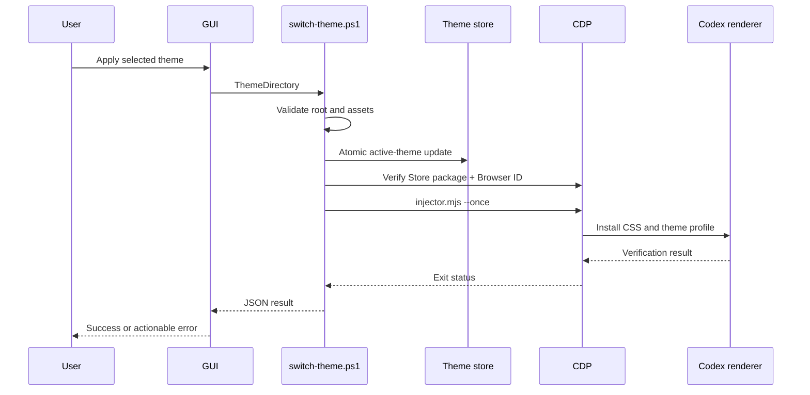

# Architecture / 架构

## System boundary

The project is an external appearance layer for the official Windows Codex package. It owns its GUI, theme library, managed Dream Skin state, and loopback CDP client. It does not own the Codex Store package, account state, conversations, projects, terminals, or native application menus.

本项目是官方 Windows Codex 包之外的外观层。它只拥有 GUI、主题库、Dream Skin 受管状态和回环 CDP 客户端，不拥有 Codex Store 包、账号状态、对话、项目、终端或原生应用菜单。

## Components

### WinForms shell

- `Program.cs` opens the unified console and retains self-test mode.
- `DashboardForm.cs` owns theme selection, previews, offline saving, hot switching, cold startup, activation, progress UI, and console tray behavior.
- `DashboardSettings.cs` persists the post-launch window preference under the managed local state root.
- `ThemeCatalog.cs` parses theme data and enforces image path containment.

### PowerShell bridge

`switch-theme.ps1` is the only GUI-to-runtime apply bridge. It restricts themes to the adjacent `themes` directory, delegates schema and asset validation to Dream Skin, updates the active store, and either returns after the safe `-SaveOnly` preparation path or dynamically verifies the current Browser ID before a one-shot injection.

### Dream Skin engine

- `common-windows.ps1`: Store package discovery, process identity, loopback port ownership, atomic files, operation locking.
- `theme-windows.ps1`: active/saved theme stores, background copy, pause state, apply/remove operations.
- `start-dream-skin.ps1`: Codex/CDP startup and watcher lifecycle.
- `injector.mjs`: CDP protocol implementation and target lifecycle.
- `renderer-inject.js`: idempotent renderer installation and cleanup.
- `dream-skin.css`: all visual overrides and frosted-glass tokens.

## Apply sequence

## Launch sequence

The console first saves the selected theme, then verifies the saved watcher PID and the Browser ID returned by `http://127.0.0.1:<port>/json/version`. A healthy session uses the fast path, hot-switches the selected theme, and activates the existing Codex window.

When unhealthy, it invokes `start-dream-skin.ps1` through Windows PowerShell 5.1. The runtime either connects to an existing verified CDP session or asks before restarting a normal Codex process. After the watcher and renderer verification pass, state is written atomically.

## State model

`%LOCALAPPDATA%\CodexDreamSkin\state.json` schema 3 records:

- watcher PID and exact UTC start time;
- injector and Node paths;
- loopback port and Browser ID;
- official Codex package root, family, version, and executable;
- active theme directory and pause file;
- creation time.

Process shutdown requires all visible identity fields to match. This prevents a stale PID from causing an unrelated process to be terminated.

## Concurrency and rollback

- PowerShell operations use a named operation lock.
- Managed engine replacement uses staging and backup directories.
- Config and state writes use same-directory atomic replacement.
- Failed startup attempts remove partial injection when possible.
- If Codex had to restart and setup fails, the runtime attempts to reopen official Codex without CDP.
- Canceling the restart consent prompt is designed to be side-effect free.

## Trust model

Themes are data: JSON plus local images. Engine and program code are trusted executable content. The release checksum protects transport integrity but is not a code-signing certificate. Users should download only from the official repository Release page and compare SHA-256 values.
